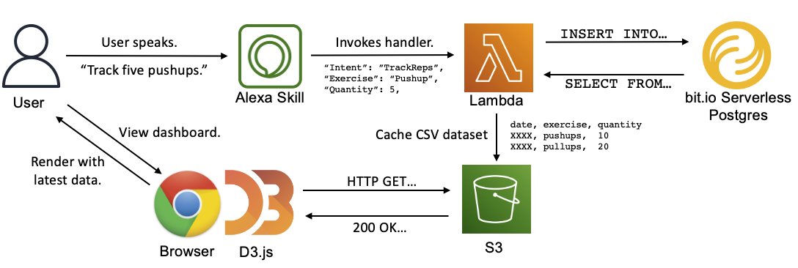

# rep-tracker
Hands-free rep tracking for common exercises using Alexa.

Alexa provides a hands-free interface for inserting data to bit.io:
[bit.io/andrewdoss/rep-tracker](https://bit.io/andrewdoss/rep-tracker).

Work-in-progress FE dashboard:
[https://www.andrewdoss.dev/reps/](https://www.andrewdoss.dev/reps/).

How it works:

# Contents
This project is a quick POC and has several TODOs that I may or may not get to:
- Write docs, including how to deploy.
- Automated tests/build/deploy.
- Auth user across multiple devices (currently just uses hash of device id).
- Replace S3 bucket dataset staging (for FE fetch) with direct HTTP query once
bit.io supports CORs for HTTP queries).
- Voice configuration of supported exercises.
- Improved dialog
    - Track multiple exercises in one utterance.
    - Reprompt for missing slots.
    - Allow user-specified rep aggregation windows, e.g. "this week" rather than just today.
- Optimizations - reuse connections for warm lambda calls, switch to HTTP queries once bit.io supports server-side pooling for HTTP endpoint. 
- Cleanup/publish FE dashboard code.
